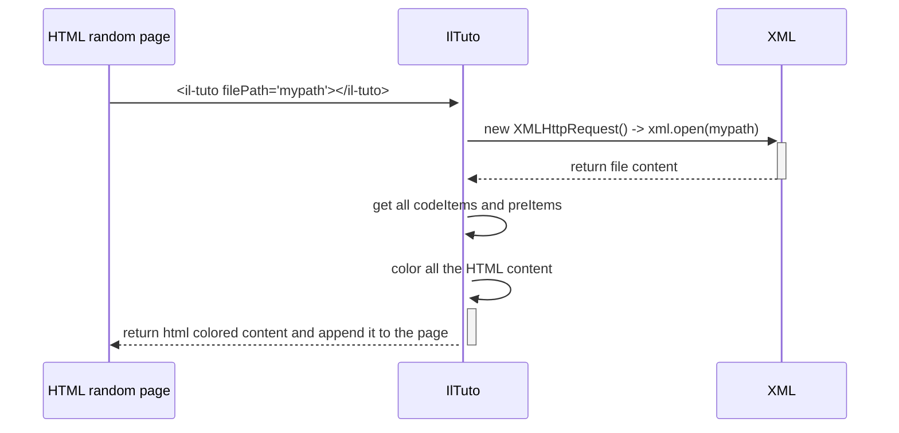

# Il-tuto

## Technologies utilisées 
- HTML
- CSS
- Typescript
- Librairies externes
	- HighlightJS (pour la coloration syntaxique)
	- TippyJS (pour les infobulles)

## Description

Ce commposant web permet d'effectuer la coloration syntaxique d'une page web lorsqu'il est appelé.

Ce composant permettra également d'afficher des infos bulles pour avoir des informations supplémentaires si la souris survole le bloc de code.

## Comment l'utiliser


1. Installer notre composant via la commande 
```
npm install il-tuto
```

2. Appeler notre composant via la balise (avec la source qui a pour entrée le fichier qu'on veut traiter, ici TSWebProg.html) 
:warning: Ne pas oublier d'intégrer la balise script qui a pour source le script exporté dans le package qu'il faut utiliser (bundle.js)
```
<il-tuto filePath="/ressources/TSWebProg.html"></il-tuto>
<script src="node_modules/iltuto/dist/bundle.js"></script>
```

## Fonctionnement

